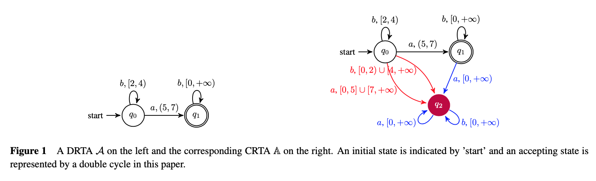

# Testing-based RTA learning algorithm

### 简介

本项目为基于测试的实时自动机（Real-time automata, RTA）模型学习的原型工具，通过PAC理论可对学习所得的模型给出统计保证（利用精确度和置信度），基于传统L*算法的Exact learning algorithm 详见[Lesliea - RTALearning](https://github.com/Leslieaj/RTALearning)。

- 版本learningRTA - 结合PAC的学习RTA的常规方法。
- 版本learningRTA_symbol -  结合PAC的学习RTA的符号化的方法。

注意，模型Guard上界是具体值，具体upperBound上界时间点不测；如果模型Guard上界是∞，具体upperBound上界时间点需测。

### 模型说明

我们假设implement RTA可以不是complete，通过算法我们学习所得的RTA为complete（CRTA）。



### 建模说明

- 模型文件 - example.json

```json
{
	"inputs": ["a", "b"],  // 输入actions
	"states": ["0", "1"],  // 状态
	"trans": {  // 迁移集（源状态, input, timeGuards, 目标状态）
		"0": ["0", "b", "[0,2)U[3,6)", "0"],
		"1": ["0", "a", "[5,7)", "1"],
		"2": ["1", "b", "[0,7)", "1"]
	},
	"initState": "0",  // 初始状态
	"acceptStates": ["1"]  // 接收状态
}
```

- 学习前需要知道的模型信息 - precondition.json

```json
{
  "inputs": ["a", "b"], // 输入actions
  "upperGuard": 7,  // 时间上界
  "sampleNum": 6, // 采样数（符号化学习使用）
  "epsilon": 0.01, // 精确度
  "delta": 0.01 // 置信度
}
```

#### Prerequisite & Usage

##### Prerequisite

- Python3
- graphviz（画图）

##### Usage

1. 样例模型在`Automata/Model`中，用户也可以根据[建模说明](#建模说明)自定义模型学习。
2. 在`learningRTA/main.py`或`learningRTA_symbol/main.py`设置对应的目标模型路径`filePath`，直接运行即可。

------

参考文献：

1. Maler O , Mens I E . A Generic Algorithm for Learning Symbolic Automata from Membership Queries[M]// Models, Algorithms, Logics and Tools. 2017.
2. Dima C. Real-time automata.[J]. Journal of Automata Languages & Combinatorics, 2001, 6(6):3-24.
3. Dana, Angluin. Learning regular sets from queries and counterexamples[J]. Information & Computation, 1987.